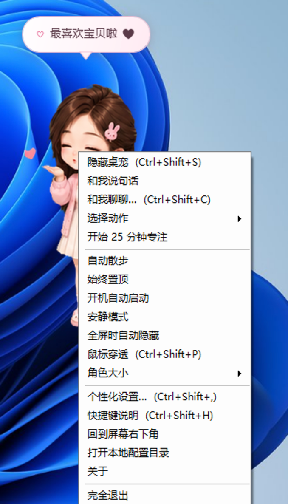

# 小申陪伴（BunnyCompanion）

> **本软件由传康KK开发**（传康Kk / 万能程序员）  
> 微信：1837620622 · 邮箱：2040168455@qq.com · 咸鱼/B站：万能程序员

面向 **Windows 10/11** 的 **桌面宠物 + 本机 Agent**：透明置顶、托盘互动、粉嫩气泡，以及可聊天、看桌面、拖文件、跑工具的微信风对话窗。


| | |
|--|--|
| 开发者 | **传康KK** |
| 产品名 | 小申陪伴 |
| 技术 | C# · WPF · .NET 8 · 自包含 EXE |
| 仓库 | [cknb6/BunnyCompanion](https://github.com/cknb6/BunnyCompanion) |
| 下载 | **[Releases](https://github.com/cknb6/BunnyCompanion/releases)** |
| 当前主版本 | **1.5.x**（Release 标签 `v1.5.0.<run>`；含 **Agent 办公模式**） |

---

## 下载哪个文件？

每个 Release 提供 **两个** 自包含 EXE（按 CPU 架构，不是同一文件复制两遍）：

| 下载这个 | 适合谁 |
|----------|--------|
| **BunnyCompanion-win-x64.exe** | **绝大多数电脑**（Intel / AMD）。Windows on ARM 多数也能跑 x64 兼容层 |
| **BunnyCompanion-win-arm64.exe** | **原生 ARM64** Windows（部分 Surface / 骁龙本） |

- **一般用户：只下 x64。**
- 同包还有 `checksums.txt`：**自动更新强制 SHA256 校验**，勿手改。
- **自包含**约 70～100MB，**无需安装 .NET**，双击运行。
- SmartScreen：更多信息 → 仍要运行。

说明：`使用说明.txt` / Release 中的 `README-zh.txt`。

### 为什么不能一个 EXE 通吃？

Windows 自包含 .NET 必须按 RID 分别打包（`win-x64` / `win-arm64`），无法合成「通用原生」单文件。本仓库采用 **同一 Release 放两个架构**，下载时选一个。

---

## 功能概要

### 桌宠互动

- 透明置顶、托盘、入场动画、**48** 张透明精灵（挥手 / 比心 / 跳舞 / 睡觉 / 读书等）
- 头/身/脚 **3×3** 点击分区、双击比心、中键开聊天、拖拽（含甩飞）、滚轮互动
- **走路朝向正确**：素材默认朝左，向右走自动水平翻转（不会倒着走）
- 像素透明命中 + 躯干软命中 + 输入自愈
- 快捷键：`Ctrl+Shift` + `S` 显隐 / `C` 聊天 / `P` 穿透 / `,` 设置 / `H` 帮助
- 自动散步、多显示器 DPI、全屏隐藏、喝水/休息、专注、生日纪念日、安静时段
- **系统监控触发器**：CPU / 内存 / 低电 / 久离返回 → 气泡提醒（设置可关阈值）

 

### Agent 对话（微信风 · 双模式）

```text
【陪伴模式】短句关心 + 轻量工具（默认）
【办公 Agent】计划 → 多步工具 → 校验交付（参考 Claude Code / CLI Agent）

在线主线路（多模态 + 本机工具循环，办公最多约 14 轮）
  → 在线短兜底（陪伴模式；办公失败会诚实说明，不假装干活）
  → 本地中文关键词（断网最终兜底）
```

聊天窗右上角 **💬 / 🛠** 切换模式（会记住设置）。

| 能力 | 说明 |
|------|------|
| **办公模式** | `plan_set` / `plan_tick` 计划闭环；`batch_move` / `batch_rename` 批量（默认 dry_run 预览）；`web_search_results` 搜索摘要；技能触发词自动注入 |
| **多模态** | 聊天 + 看桌面截图 + 发图识图（看桌面需主动点「看桌面」或说相关意图） |
| **本机工具 40+** | 定位、天气、备忘、星座、文件读写移动、批量、PowerShell、剪贴板、系统监控、网页、技能、**语音**、计划工具等 |
| **工具循环** | function calling + 多工具并行；伪 XML 工具标签本地解析并清洗 |
| **路径别名** | `桌面` / `Desktop` / `文档` / `下载` 等 |
| **附件** | 「＋」· **拖进窗口**（含微信图）· Ctrl+V |
| **语音** | 🎤 输入 · 朗读回复（可关） |
| **记忆** | `companion_memory.json` + `agent.md` + 办公计划 `office_plan.json` |
| **预取** | 定位/天气等本地真数据（重办公任务不截断 tools） |

### 附件规则（请按此使用）

| 规则 | 限制 |
|------|------|
| 数量 | 最多 **6** 个附件 / 次 |
| 图片 | 最多 **4** 张；自动缩到约 1280px；过大跳过 |
| 单文件 | ≤ **8MB** |
| 图片 | 识图进多模态 |
| 文本/代码 | 预读正文进提示词（限长） |
| 其它类型 | **本机绝对路径**交给 Agent，用 `read_file` / `open_path` / `move_path` 等工具处理 |
| 文件夹 | 拖入时尝试添加其中首层文件；完整操作可让 Agent 列目录 |
| 输入框 | 禁止把路径当文字粘贴；拖放由窗口统一接收 |

### 自动更新（防篡改）

- 托盘 **「检查更新…」**，或设置开启 **自动检查更新**（启动约 12 秒后静默查）
- **仅** 官方仓库 Release：`cknb6/BunnyCompanion`
- 流程：读 latest → 下对应架构 EXE + `checksums.txt` → **SHA256 校验** → 不一致 **拒绝并删临时文件** → 通过后脚本替换并重启
- 勿用不明网盘改名包；污染文件无法通过哈希

### 其它

- 本地设置、爱心值、互动次数；单实例
- **一键卸载**：清启动项、本地数据，并尝试删 EXE

---

## v1.4 更新要点

### Agent 调用

- 修复 **空回复被误判为失败**（工具调用回合往往没有正文，这是正常现象）
- 主线路单次超时可控；备用线路 **短超时 + 少尝试**，避免串行卡死数分钟
- 支持多工具并行；工具跑完后强制中文总结；若模型仍空回复则 **用工具结果本地拼装兜底**
- 路径参数规范化（`~/Desktop` → 桌面等）；伪工具标签解析 + 清洗

### 附件与拖拽

- 全窗拖放、FileDrop / FileNameW 兼容；输入框 `AllowDrop=False`
- 非文本文件以路径形式交给 Agent；拖文件夹展开首层文件

### 体验与发布

- 走路朝向修正；语音默认朗读；农历星座；自动更新 + SHA256
- CI 将版本写入 `1.4.0.<run_number>` 供更新比较

---

## 本地构建

需要 .NET 8 SDK 或 VS2022「.NET 桌面开发」。

```bat
一键构建Windows版.bat
```

```powershell
.\Build-Windows.ps1 -Runtime win-x64
.\Build-Windows.ps1 -Runtime win-arm64
# CI 会传入 -VersionOverride 1.4.0.<run>
```

产物：`可直接发送\`。日常发布推荐 **push main → Actions 自动 Release**。

---

## CI

- 工作流：`.github/workflows/build-windows.yml`
- 矩阵：`win-x64` + `win-arm64`
- 发布前：离线词库、GoalVerify、结构校验、双架构 SHA256
- 成功后 GitHub Release：`v<Version>.<run_number>`

[Actions](https://github.com/cknb6/BunnyCompanion/actions) · [Releases](https://github.com/cknb6/BunnyCompanion/releases)

---

## 本地数据

`%LocalAppData%\BunnyCompanion\`（一键卸载整目录清除）：

> **升级只替换 EXE，本地数据完整保留**：自动更新或手动覆盖安装新版本时，设置、爱心值、长期记忆、技能、备忘录都不会丢失，升级后无需重新配置。只有「一键卸载」才会清除该目录。

| 文件 | 含义 |
|------|------|
| `settings.json` | 设置、爱心、位置、是否自动检查更新等 |
| `companion_memory.json` | 人物 / 偏好 / 备忘 / 星座 |
| `agent.md` | 对话摘要压缩 + 手写备注 |
| `updates\` | 自动更新临时包 |
| `Logs\crash.log` | 崩溃日志 |

开机启动：`HKCU\Software\Microsoft\Windows\CurrentVersion\Run`，管理员运行时额外创建登录触发的计划任务作为回退（绕过 UAC，适合需提升权限的 Agent）。  
基础陪伴可完全离线；仅 Agent 在线通道时联网。

---

## 开发者

**本软件由传康KK开发。**

- 微信：1837620622（传康Kk）
- 邮箱：2040168455@qq.com
- 咸鱼 / B站：万能程序员
- GitHub：[1837620622](https://github.com/1837620622)
- 项目仓库：[cknb6/BunnyCompanion](https://github.com/cknb6/BunnyCompanion)

## 隐私与安全

- 姓名、对话、记忆、位置 **仅存本机**：无账号、无云同步、无遥测、无广告
- 仅 Agent 在线时联网；断网本地陪伴
- 看桌面需主动触发，不后台偷拍
- `run_command` / `delete_path` 高权限，有护栏；更新包强制 SHA256
- 个人制作、未购商业代码签名时 SmartScreen 可能提示未知发布者
- 角色为参考照片衍生 Q 版；原图不进 EXE。公开发布/商用需自行确认肖像与签名授权

## 使用许可

本仓库当前未授予开源许可，源码、角色素材与截图均保留所有权利。转载、二次分发、商用或衍生前请联系传康KK。
