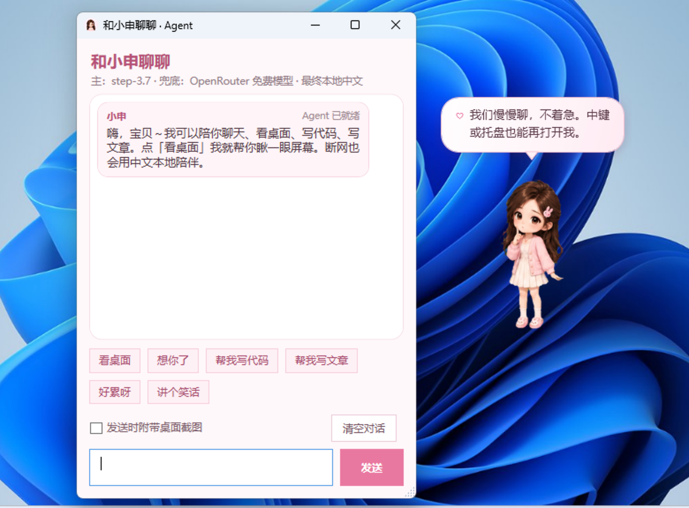
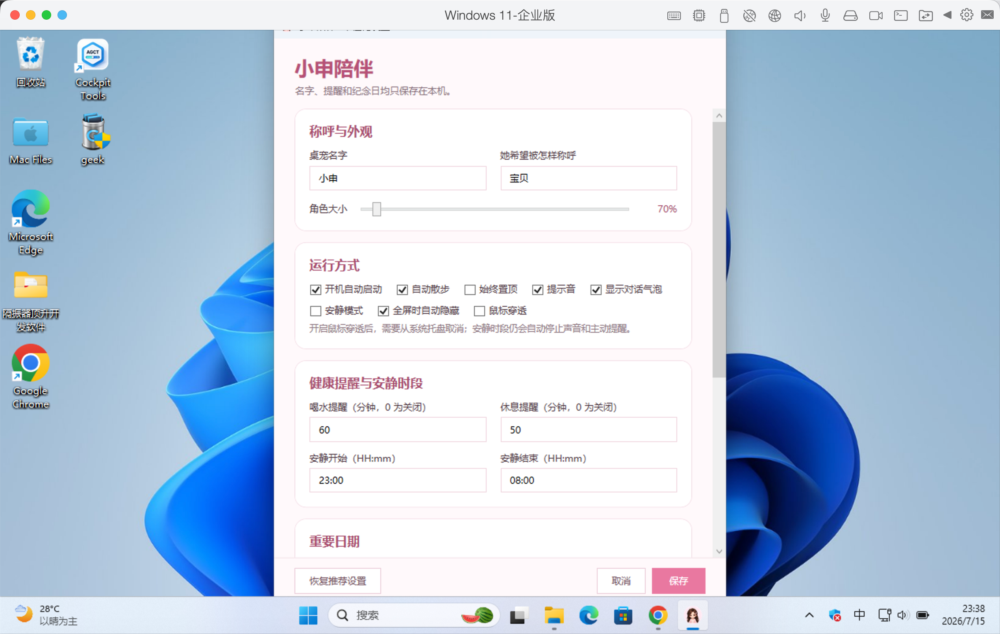
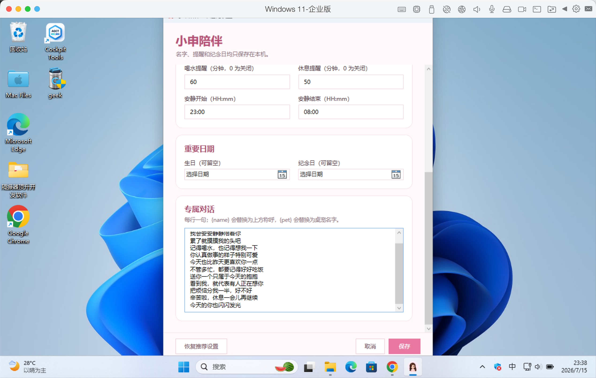
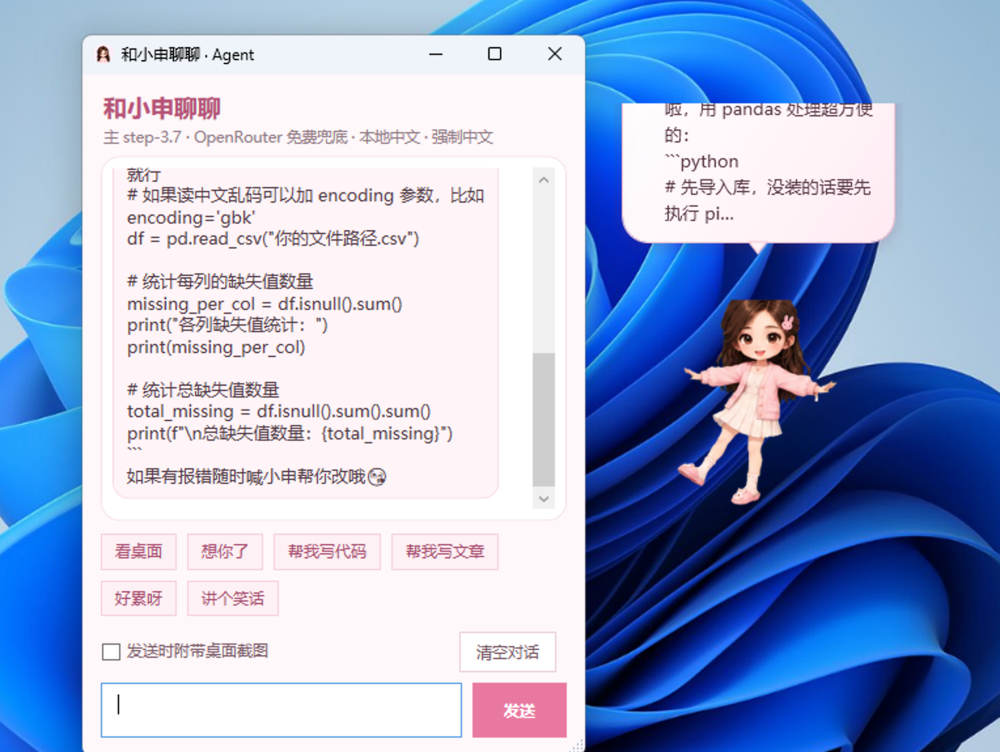

# 小申陪伴（BunnyCompanion）

> **本软件由传康KK开发**（传康Kk / 万能程序员）  
> 微信：1837620622 · 邮箱：2040168455@qq.com · 咸鱼/B站：万能程序员

面向 **Windows 10/11** 的桌面宠物：透明置顶、托盘、点击互动、粉嫩气泡，以及可聊天 / 看桌面的多模态 Agent。


| | |
|--|--|
| 开发者 | **传康KK** |
| GitHub 大号 | [1837620622](https://github.com/1837620622)（身份 / 协作；Actions 额度不足时不用于打包） |
| GitHub 小号 | [cknb6](https://github.com/cknb6)（**仓库托管 + Actions 打包发布**） |
| 技术 | C# · WPF · .NET 8 |
| 仓库 | [cknb6/BunnyCompanion](https://github.com/cknb6/BunnyCompanion) |
| 下载 | **[Releases](https://github.com/cknb6/BunnyCompanion/releases)**（由小号 Action 自动打包） |

---

## 下载哪个文件？

Release 里按 **CPU 架构** 提供 **两个** 自包含 EXE（不是同一个文件复制很多遍）：

| 下载这个 | 适合谁 |
|----------|--------|
| **BunnyCompanion-win-x64.exe** | **绝大多数电脑**（Intel / AMD）。Windows on ARM 多数也能靠兼容层运行 x64 版 |
| **BunnyCompanion-win-arm64.exe** | **原生 ARM64** 的 Windows 设备（部分 Surface / 骁龙本），要更好性能时选它 |

另外可能带有中文名 `小申陪伴-x64.exe` / `小申陪伴-arm64.exe`，与对应英文名是**同一架构各一份**。

- **一般用户：只下 x64 即可。**  
- **不要**以为要下齐所有 exe；以前 Release 里多个英文名曾是**同一 x64 文件的重复拷贝**，现已改成「一架构一文件」。

### 运行

- **自包含**，体积大约 **70～100MB / 每个架构**  
- **无需安装 .NET**，双击运行  
- SmartScreen：更多信息 → 仍要运行  

说明文件：`使用说明.txt` / Release 中的 `README-zh.txt`。

---

## 为什么不能「一个 EXE 通吃 x86 + ARM」？

| 说法 | 实际情况 |
|------|----------|
| 自包含 .NET / WPF | 必须按 **RID** 分别发布：`win-x64`、`win-arm64`（以及少见的 `win-x86`） |
| 一个「通用原生」EXE | **做不到**（Windows 不是 macOS 那种 fat binary 生态） |
| 多数安卓/商店「通用」 | 往往是安装包内含多架构，安装时再选，不是单个自包含 WPF EXE |

因此本仓库采用：**同一 Release 里放 x64 + arm64 两个包**，下载时选一个。

---

## 功能概要



- 透明置顶、托盘、启动入场动画、48 帧透明精灵素材（组合出挥手/比心/跳舞/睡觉/读书等更多动作）
- 头/身/脚 3×3 点击分区、双击比心、中键聊天、拖拽（含甩飞反馈）、滚轮互动、右键菜单
- 像素级透明命中（空白不挡桌面）+ 躯干软命中兜底 + 输入自愈（修复“用着用着点不上”）
- 快捷键：`Ctrl+Shift` + `S` 显隐 / `C` 聊天 / `P` 穿透 / `,` 设置 / `H` 帮助
- 自动散步、多显示器 per-monitor DPI、全屏自动隐藏、喝水/休息提醒、25 分钟专注、生日与纪念日彩蛋、安静时段
- 本地保存设置、爱心值与互动次数；单实例运行
- **一键卸载**：右键菜单清除启动项、本地数据，并尝试删除 EXE  

### 互动与动作

 

点哪有哪样的反馈：摸头、比心、跳舞、害羞、好奇、喝水……连点有彩蛋，拖拽会撒娇，甩飞会晕。


### Agent



```text
阶跃 step-3.7-flash（主：聊天 + 看桌面 + 工具循环）
  → OpenRouter 免费模型（在线兜底，文本/视觉两组）
  → 阶跃纯文本（无工具再试）
  → 本地中文关键词（断网最终兜底）
```



- **看桌面**需用户主动触发（点「看桌面」或说相关意图），不会后台连环截屏。
- **本机工具**（26 个，真实操作 Windows，非假装）：定位 / 天气预警 / 备忘提醒 / 星座 / 今日卡 / 列目录 / 读写移动复制删除文件 / 搜索 / PowerShell / 打开路径或网址 / 剪贴板 / 特殊文件夹 / 进程列表 / 系统信息等。删除与命令有高危护栏，系统关键路径拒绝操作。
- **长期记忆**（双层，均只存本机）：
  - 结构化 `companion_memory.json`：聊到的人名、偏好、备忘、星座/生日。
  - 滚动摘要 `agent.md`：每轮对话自动摘要压缩，超长自动折叠旧回合；托盘「打开长期记忆 agent.md」可查看并手写补充备注区。
- 定位/天气类问题即使模型不会调用工具，也会**本地预取真实数据**再回答，避免瞎编城市气温。

---

## 本地构建

需要 .NET 8 SDK 或 VS2022「.NET 桌面开发」。

```bat
一键构建Windows版.bat
```

或指定架构：

```powershell
.\Build-Windows.ps1 -Runtime win-x64
.\Build-Windows.ps1 -Runtime win-arm64
```

产物目录：`可直接发送\`。

> 日常发布推荐直接用 GitHub Actions（push 到 main 自动打包发 Release），本地构建仅用于调试或自定义打包。

---

## CI

- 工作流：`.github/workflows/build-windows.yml`  
- 矩阵构建：`win-x64` + `win-arm64`  
- 成功后自动 **GitHub Release**（tag `v<版本>.<run_number>`，版本号取自 `BunnyCompanion.csproj` 的 `<Version>`，与程序内「关于」一致）  

[Actions](https://github.com/cknb6/BunnyCompanion/actions) · [Releases](https://github.com/cknb6/BunnyCompanion/releases)

---

## 本地数据

全部保存在 `%LocalAppData%\BunnyCompanion\`，一键卸载会整目录清除：

- `settings.json` — 设置、爱心值、互动次数、窗口位置
- `companion_memory.json` — 结构化长期记忆（人物/偏好/备忘/星座）
- `agent.md` — 对话自动摘要压缩的长期记忆（滚动摘要 + 近期压缩 + 用户手写备注）
- `Logs\crash.log` — 崩溃日志
- 开机启动：当前用户注册表 `HKCU\Software\Microsoft\Windows\CurrentVersion\Run`

基础陪伴与本地台词库可完全离线；仅 Agent 走在线通道时联网，且只发送当前对话必要内容。  

---

## 开发者

**本软件由传康KK开发。**



- 微信：1837620622（传康Kk）
- 邮箱：2040168455@qq.com
- 咸鱼 / B站：万能程序员
- GitHub **大号**：[1837620622](https://github.com/1837620622)（开发者身份；commit 用 `1837620622@qq.com`）
- GitHub **小号**：[cknb6](https://github.com/cknb6)（因大号 Actions 额度不足，**用小号仓库跑 CI / 打 EXE / 发 Release**）

## 隐私与安全

- 姓名、纪念日、对话、互动次数、窗口位置、记忆**仅存本机**，无账号、无云同步、无遥测、无广告。
- 仅在打开 Agent 聊天并走在线通道时联网（阶跃/OpenRouter）；断网自动切本地陪伴。
- 看桌面需主动触发，不后台偷拍。
- `run_command` / `delete_path` 属高权限工具，有命令与路径护栏，仅执行用户明确要求的操作。
- 个人制作、未购买商业代码签名证书，SmartScreen 可能提示“未知发布者”，确认来源可信后即可运行。
- 角色素材为参考照片衍生的 Q 版形象，参考照片原图不含在工程和最终 EXE 中；如公开发布或商业使用，需另行确认照片人物的肖像授权，并使用可信代码签名证书。

## License

以仓库说明为准；转载 / 商用请先联系传康KK授权。
